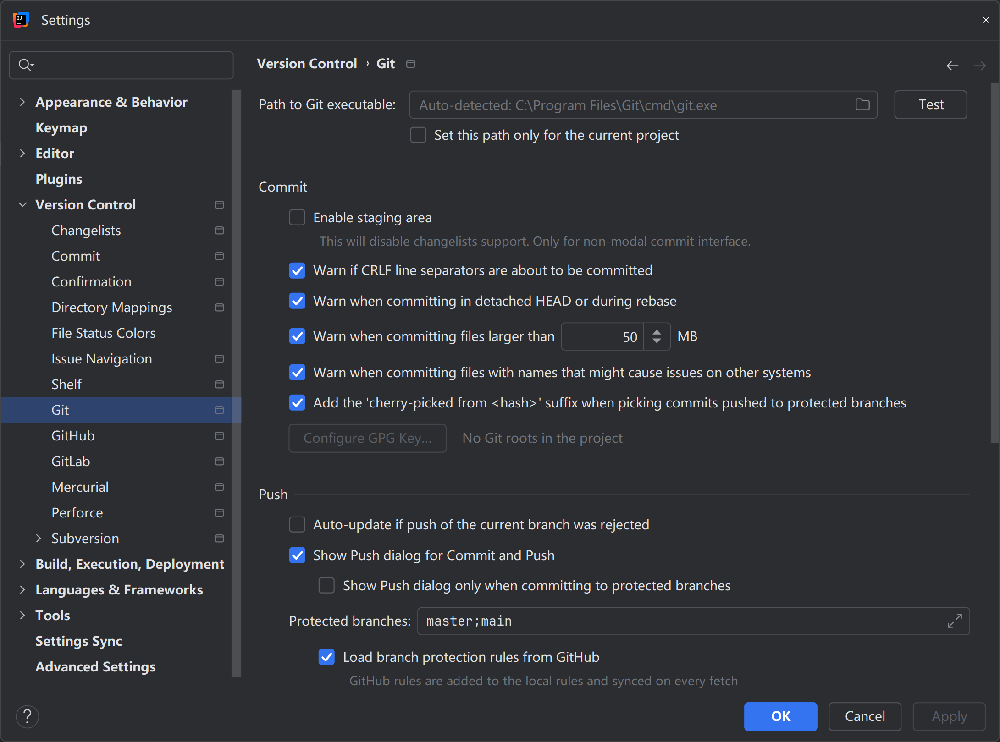
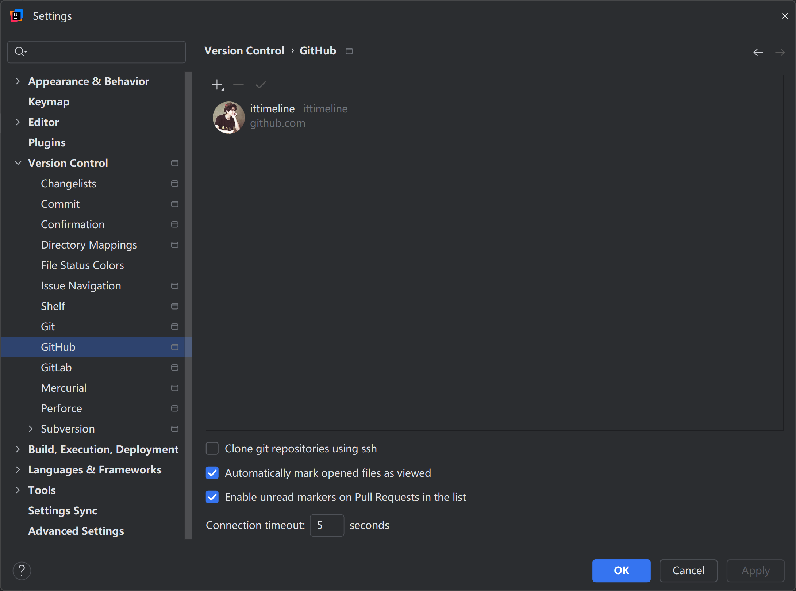
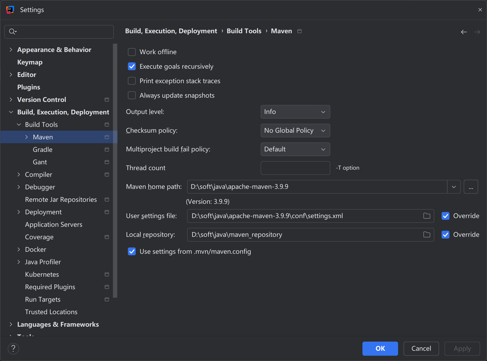

# 跟光磊学Java从小白到架构师

## 第01阶段 Java语言核心技术

### 开发环境

| 工具   | 版本                                  |
|------|-------------------------------------|
| 操作系统 | Windows11 24 H2 /macOS Sequoia 15.0 |
| JDK  | JDK 21.0.4                          |
| IDE  | IntelliJ IDEA 2024.2.3              |
| 版本控制 | Git 2.47.0                          |
| 项目构建 | Maven 3.9.9                         |

### macOS JDK配置

Java官网：https://www.oracle.com/java/

   ```shell
   # 配置Oracle ARM64位架构macOS版Java21的JAVA_HOME环境变量
   export JAVA_HOME=/Library/Java/JavaVirtualMachines/jdk-21.jdk/Contents/Home
   
   # 使用JAVA_HOME环境变量配置Oracle ARM64位架构macOS版Java21的PATH环境变量
   export PATH=$PATH:$JAVA_HOME/bin
   ```

### IntelliJ IDEA VM Options配置

IntelliJ IDEA官网：https://www.jetbrains.com/idea/

```properties
-Xms1024m
-Xmx4096m
-XX:CICompilerCount=8
-XX:ReservedCodeCacheSize=2048m
```

### Git配置

Git官网：https://git-scm.com/

Git设置全局用户名和邮箱

```shell
git config --global user.name "ittimeline"
git config --global user.email "ittimelinedotnent@gmail.com"
```

Git设置全局代理

```shell
git config --global http.proxy http://127.0.0.1:7890
git config --global https.proxy http://127.0.0.1:7890
```

### IntelliJ IDEA集成Git



### IntelliJ IDEA集成GitHub



### Maven 配置

Maven官网：https://maven.apache.org/

setting.xml配置

```xml
<!-- 本地仓库配置 -->
<localRepository>D:/soft/java/maven_repository</localRepository>


        <!-- 阿里云maven镜像仓库配置 -->
<mirror>
<id>aliyun-maven</id>
<mirrorOf>*,!spring-milestones</mirrorOf>
<name>阿里云公共仓库</name>
<url>https://maven.aliyun.com/repository/public</url>
</mirror>
```

### IntelliJ IDEA集成Maven


