# 环境配置

| 软件  | 版本                   |
|-------|------------------------|
| OS    | Windows 11 2026 H2     |
| JDK   | Java 25.0.4.1          |
| IDE   | IntelliJ IDEA 2026.2.3 |
| Build | Maven 3.10             |
| VCS   | Git 2.56.0             |

***

## Java

### Java官网和官方文档

Java官网 https://www.oracle.com/java/

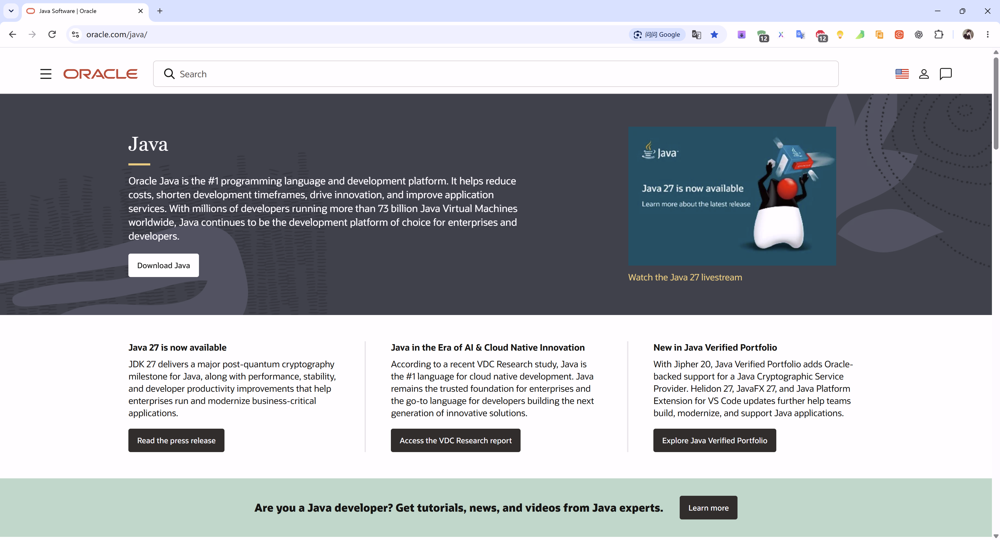

https://docs.oracle.com/en/java/javase/25/


### Java环境变量配置

1. JAVA_HOME环境变量配置


2. PATH环境变量配置

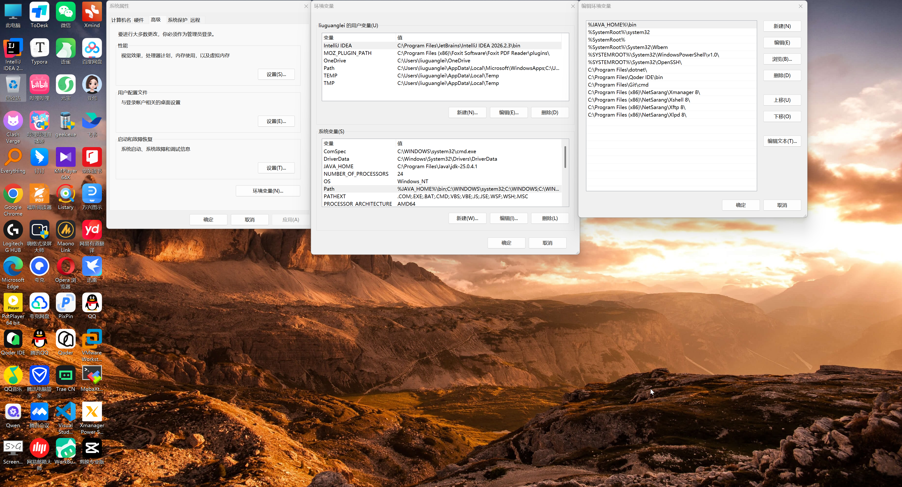

3. 验证Java环境

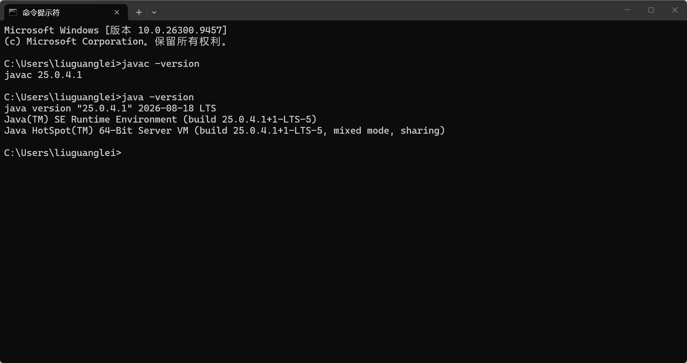

## Maven

### Maven官网

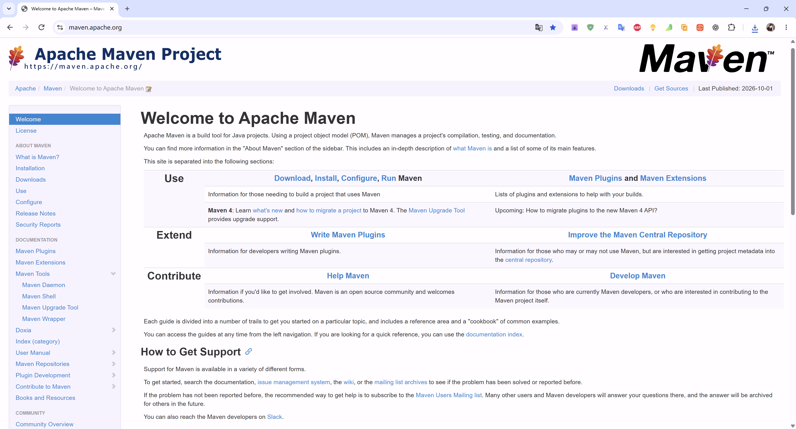

### Maven环境变量配置

1. MAVEN_HOME环境变量

   

2. PATH环境变量配置

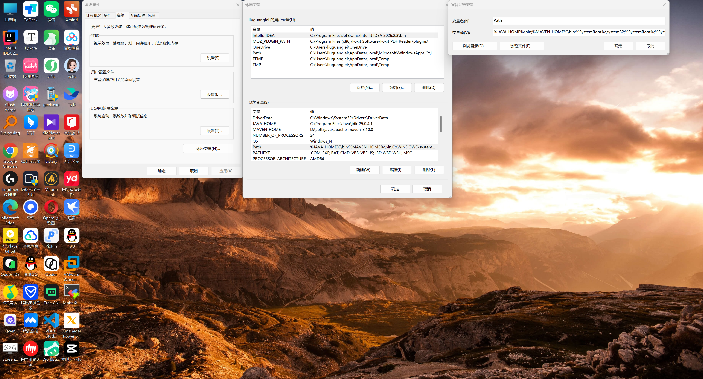

3. 验证Maven环境

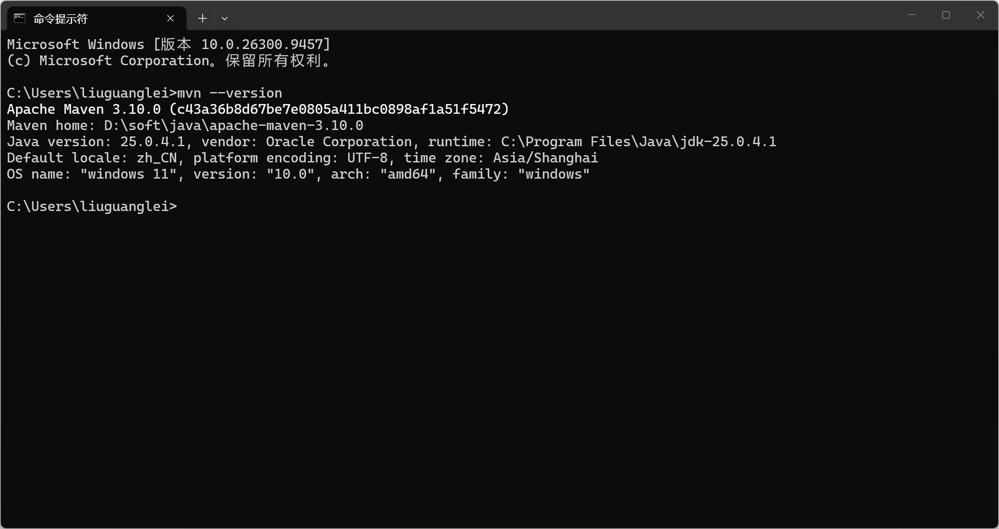

### Maven设置

修改%MAVEN_HOME%\conf\settings.xml

1. 本地仓库配置

```xml

<localRepository>D:\soft\java\maven-repository</localRepository>

```

2. 阿里云镜像仓库[配置](https://maven.aliyun.com/mvn/guide)

```xml

<mirror>
    <id>aliyunmaven</id>
    <mirrorOf>*</mirrorOf>
    <name>阿里云公共仓库</name>
    <url>https://maven.aliyun.com/repository/public</url>
</mirror>
```

## Git

### Git官网和官方文档

Git官网 https://git-scm.com/

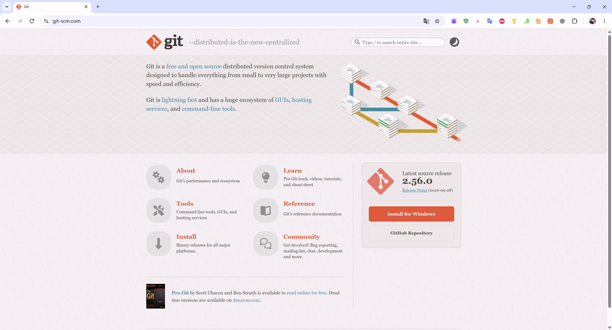

Git官方文档 https://git-scm.com/docs

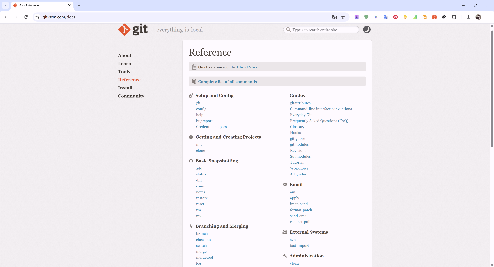

### 配置用户名

```shell
git config --global user.name "ittimeline"
```

### 配置邮箱

```shell
git config --global user.email "ittimelinedotnet@gmail.com"
```

### 配置换行符

```shell
git config --global core.autocrlf true
```

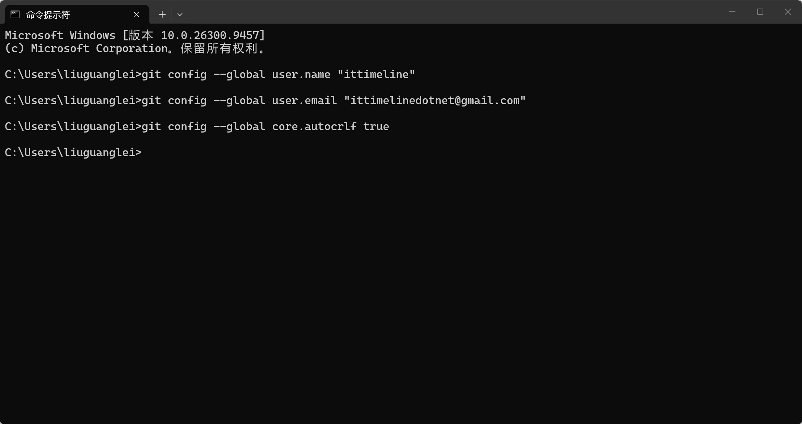

## 配置全局代理

```shell
git config --global http.proxy http://127.0.0.1:7899
git config --global https.proxy https://127.0.0.1:7899
```

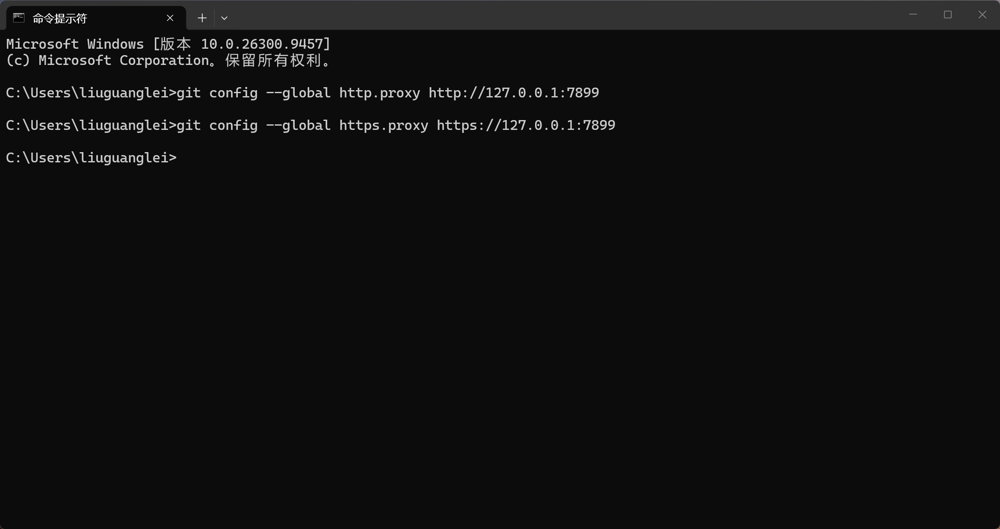

## IntelliJ IDEA

### IntelliJ IDEA 官网和官方文档

IntelliJ IDEA 官网 https://www.jetbrains.com/idea/


IntelliJ IDEA 官方文档 https://www.jetbrains.com/help/idea/getting-started.html


### IntelliJ IDEA VMOptions 设置

修改C:\Program Files\JetBrains\IntelliJ IDEA 2026.2.3\bin目录下的idea64.exe.vmoptions

- 默认设置

  ```properties
  -Xms128m
  -Xmx2048m
  -XX:JbrShrinkingGcMaxHeapFreeRatio=40
  -XX:ReservedCodeCacheSize=512m
  -XX:+HeapDumpOnOutOfMemoryError
  -XX:-OmitStackTraceInFastThrow
  -XX:CICompilerCount=2
  -XX:+IgnoreUnrecognizedVMOptions
  -XX:+UnlockDiagnosticVMOptions
  -XX:TieredOldPercentage=100000
  -XX:+UseCompactObjectHeaders
  --sun-misc-unsafe-memory-access=allow
  -ea
  -Dsun.io.useCanonCaches=false
  -Dsun.java2d.metal=true
  -Djbr.catch.SIGABRT=true
  -Djdk.http.auth.tunneling.disabledSchemes=""
  -Djdk.attach.allowAttachSelf=true
  -Djdk.module.illegalAccess.silent=true
  -Djdk.nio.maxCachedBufferSize=2097152
  -Djava.util.zip.use.nio.for.zip.file.access=true
  -Dkotlinx.coroutines.debug=off
  -Dskiko.rendering.useScreenMenuBar=false
  -Djava.nio.file.spi.DefaultFileSystemProvider=com.intellij.platform.core.nio.fs.MultiRoutingFileSystemProvider
  -javaagent:C:/Users/Public/.jb_run/ja-netfilter.jar
  ```

- 32G内存参考设置

```properties
-Xms4096m
-Xmx4096m
-XX:JbrShrinkingGcMaxHeapFreeRatio=80
-XX:ReservedCodeCacheSize=2048m
-XX:+HeapDumpOnOutOfMemoryError
-XX:-OmitStackTraceInFastThrow
-XX:CICompilerCount=8
-XX:+IgnoreUnrecognizedVMOptions
-XX:+UnlockDiagnosticVMOptions
-XX:TieredOldPercentage=100000
-XX:+UseCompactObjectHeaders
--sun-misc-unsafe-memory-access=allow
-ea
-Dsun.io.useCanonCaches=false
-Dsun.java2d.metal=true
-Djbr.catch.SIGABRT=true
-Djdk.http.auth.tunneling.disabledSchemes=""
-Djdk.attach.allowAttachSelf=true
-Djdk.module.illegalAccess.silent=true
-Djdk.nio.maxCachedBufferSize=2097152
-Djava.util.zip.use.nio.for.zip.file.access=true
-Dkotlinx.coroutines.debug=off
-Dskiko.rendering.useScreenMenuBar=false
-Djava.nio.file.spi.DefaultFileSystemProvider=com.intellij.platform.core.nio.fs.MultiRoutingFileSystemProvider
-javaagent:C:/Users/Public/.jb_run/ja-netfilter.jar

```

### IntelliJ IDEA 激活

https://ckey.run/

- Windows版IntelliJ IDEA

```shell
irm ckey.run|iex
```

按 Win + X，选择 Windows PowerShell（管理员）运行即可。


### IntelliJ IDEA 常用设置

1. 外观字体


2. 编辑器字体


3. 自动导包


4. 控制台设置


5. 文件和代码模板设置

```java
/**
 * ${description}
 *
 * @author tony 18601767221@163.com
 * @version ${DATE} ${TIME}
 * @since Java 25
 */
```


6. 保存操作

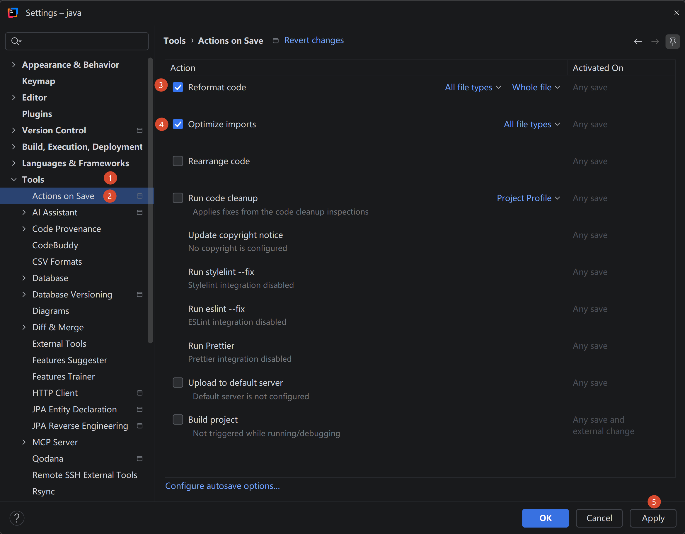

### IntelliJ IDEA 集成Maven


### IntelliJ IDEA 集成GitHub


### IntelliJ IDEA 常用插件

- [Statistics](https://plugins.jetbrains.com/plugin/4509-statistic)
- [Translation](https://plugins.jetbrains.com/plugin/8579-translation)
- [Grep Console](https://plugins.jetbrains.com/plugin/7125-grep-console)
- [XCodeMap](https://plugins.jetbrains.com/plugin/24648-xcodemap)


